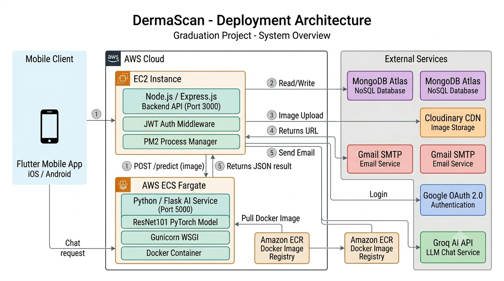

# DermaScan Application Architecture

This document outlines the high-level architecture of the DermaScan application.

## System Overview

DermaScan is a distributed application consisting of three main tiers: a mobile frontend, a centralized backend API, and a specialized AI inference service.

## Component Breakdown

### 1. Frontend: Flutter Mobile App
- **Role:** The primary user interface for end-users to capture images of skin lesions, view analysis results, and manage their profile.
- **Interactions:** Communicates exclusively with the Node.js Backend API via standard RESTful HTTP requests using JSON.

### 2. Backend: Node.js / Express API
- **Role:** The central orchestrator of the system. It handles business logic, user authentication, data routing, and acts as a gateway to other services.
- **Key Responsibilities:**
  - **Authentication:** Manages user registration, login (JWT), and Google OAuth integration.
  - **Data Management:** Handles CRUD operations for users and lesion records.
  - **Upload Coordination:** Receives image uploads from the mobile app (via `multer`) and forwards them to Cloudinary for permanent storage.
  - **AI Coordination:** Initiates the analysis process by passing the image to the AI Service and formatting the response for the frontend.

### 3. Data Storage: MongoDB Atlas
- **Role:** The primary database for the application.
- **Data Stored:** User accounts, authentication metadata, historical lesion records, and pointers (URLs) to images stored in Cloudinary.

### 4. Image Storage: Cloudinary
- **Role:** Specialized, optimized storage for user-uploaded lesion images.
- **Interaction:** The backend uploads the raw image to Cloudinary, which returns a stable URL. This URL is then saved in MongoDB and passed to the AI Service for analysis.

### 5. AI Service: Python / Flask on AWS ECS Fargate
- **Role:** A dedicated, stateless microservice solely responsible for executing the machine learning model.
- **Infrastructure:** Containerized using Docker and deployed on AWS ECS Fargate. It uses a lightweight Flask web server running via Gunicorn.
- **Model:** A PyTorch ResNet101 model running CPU-only inference.
- **Interaction:** Exposes a single `/predict` endpoint. The Node.js backend sends a multipart form containing the image bytes. The service returns structured JSON containing risk levels, confidence scores, and specific condition classifications (e.g., Melanoma, BCC, Nevus).
